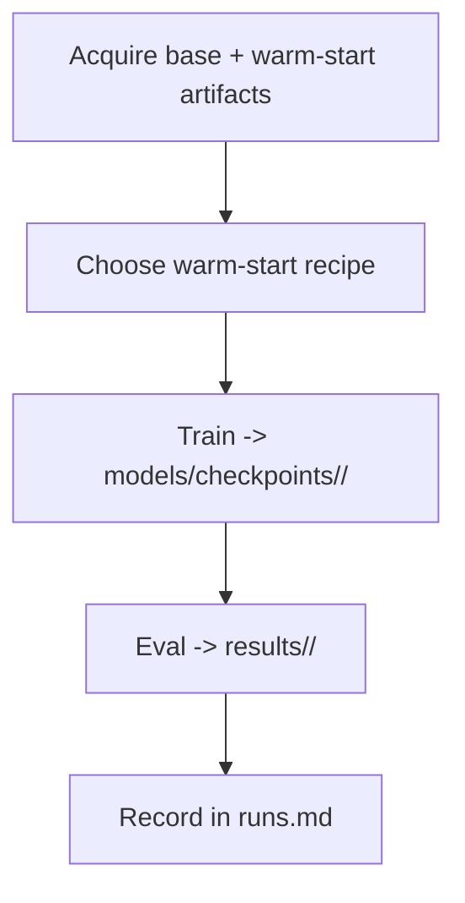

# Repo Cleanup / Professionalization Implementation Plan

> **For agentic workers:** REQUIRED SUB-SKILL: Use superpowers:subagent-driven-development (recommended) or superpowers:executing-plans to implement this plan task-by-task. Steps use checkbox (`- [ ]`) syntax for tracking.

**Goal:** Professionalize the `adaptive-latent-reasoning` repo — clean the `pondernet/` module, wire in local data, restructure `models/`/`outputs/`/`results/` under a run-id convention, and document the pipeline — without changing any training/loss math.

**Architecture:** Seven sequential tasks mirroring §10 of the spec. Tasks 1–3 and 5 are code/docs edits verified by `py_compile` + greps + smoke. Task 4 restructures directories and fixes git tracking. Task 6 builds a `runs.md` manifest and **halts for user approval before any file move/delete**. Task 7 writes the pipeline doc.

**Tech Stack:** Python 3.12, PyTorch 2.7, HuggingFace `transformers`/`peft`/`datasets`, bash scripts, git (+ LFS), `uv` for env management.

**Spec:** `docs/superpowers/specs/2026-06-10-repo-professionalization-design.md`
**Branch:** `valen/repo-cleanup` (already checked out)
**Repo root:** `/home/tpnlp/adaptive-latent-reasoning` (all paths below are relative to it unless noted)

**Conventions for this plan:**
- There is no `pytest` suite. "Verify" means: `python -m py_compile <files>` (syntax safety), targeted `grep` (confirm removals/renames), and `git status`/`git ls-files` (tracking checks). A full GPU train/eval smoke is the final integration check in each relevant task — run it when a GPU is free; it needs the gitignored `models/pretrained/simcot-gpt2-codi/` checkpoint present.
- Line numbers are anchors from a review snapshot and may drift; match on the quoted code, not the number.
- Commit after every task. Never use `git add -A` (untracked 100MB+ data/model files are present and gitignored — add explicit paths only).

---

## Task 1: Module hygiene — packaging + bug fixes + dead-code purge (§12)

**Files:**
- Delete: `pondernet/.venv/` (5.6 GB, gitignored)
- Modify: `pondernet/requirements.txt`
- Modify: `pondernet/train.py` (imports, `read_json`, `get_answer_token_position`, seeding)
- Modify: `pondernet/test.py` (`read_json`/`write_json`, `set_seed`, eval loop)
- Modify: `pondernet/src/model.py` (dead pdb lines, no-op branch, dup imports)
- (`.gitattributes` is handled in Task 4 alongside the decoder move, to keep that change atomic.)

- [ ] **Step 1: Delete the redundant virtualenv**

```bash
cd /home/tpnlp/adaptive-latent-reasoning
du -sh pondernet/.venv          # confirm ~5.6G before removing
rm -rf pondernet/.venv
test ! -e pondernet/.venv && echo "OK: .venv gone"
```

- [ ] **Step 2: Slim `pondernet/requirements.txt` to direct deps**

Replace the full `pip freeze` (60+ lines incl. transitive + `nvidia-*` wheels) with only the direct imports, and point at `uv` as the source of truth. Write `pondernet/requirements.txt` as:

```
# Direct dependencies for the pondernet module.
# Source of truth for the full, pinned environment is the repo-root uv setup
# (pyproject.toml + uv.lock). Recreate with:  uv sync
# This file is a convenience for non-uv users:  pip install -r requirements.txt
torch==2.7.1
transformers==4.52.4
peft==0.15.2
datasets==3.6.0
accelerate==1.7.0
safetensors==0.5.3
tensorboardX==2.6.2.2
numpy==2.2.6
tqdm==4.67.1
```

- [ ] **Step 3: Fix the hang bug — `breakpoint()` in a bare except**

In `pondernet/train.py`, the nested `get_answer_token_position` (~line 247) ends with `except Exception: breakpoint()`. Replace the whole function body's except so it raises with context, and remove the dead `pdb` comment:

```python
    def get_answer_token_position(tokens, answer_prompts, tokenizer):
        try:
            match_indices = (tokens.unfold(0, len(answer_prompts[0]), 1) == answer_prompts[0]).all(dim=1).nonzero(as_tuple=True)[0].item()
            answer_token_id = match_indices + len(answer_prompts[0])
            return answer_token_id
        except Exception as e:
            raise ValueError(
                f"Could not locate answer prompt {answer_prompts[0].tolist()} in token sequence "
                f"{tokens.tolist()}"
            ) from e
```

- [ ] **Step 4: Make `read_json`/`write_json` raise instead of swallowing errors**

In `pondernet/train.py` (~line 42) replace `read_json` with (English docstring, no error swallow):

```python
def read_json(file_path):
    """Read a JSON document from file_path and return the parsed object."""
    with open(file_path, "r", encoding="utf-8") as file:
        return json.load(file)
```

In `pondernet/test.py` (~lines 65–85) replace both `read_json` and `write_json`:

```python
def read_json(file_path):
    """Read a JSON document from file_path and return the parsed object."""
    with open(file_path, "r", encoding="utf-8") as file:
        return json.load(file)


def write_json(data, file_path):
    """Write a Python object to file_path as pretty-printed JSON."""
    with open(file_path, "w", encoding="utf-8") as file:
        json.dump(data, file, ensure_ascii=False, indent=4)
```

- [ ] **Step 5: Add explicit train-side seeding**

In `pondernet/train.py`, at the top of `def train():` (right after `parser.parse_args_into_dataclasses()` at ~line 158), add deterministic seeding of numpy/random (HF already seeds torch via `training_args.seed`):

```python
    import numpy as np
    random.seed(training_args.seed)
    np.random.seed(training_args.seed)
```

(`random` is already imported at the top of the file; this also makes the otherwise-unused `random` import meaningful.)

- [ ] **Step 6: Restore the eval seed guard + force a single greedy pass**

In `pondernet/test.py`, line 253 has `#set_seed(42)` inside `evaluation()`. Uncomment and parameterize it to seed from the args at eval start:

```python
    set_seed(training_args.seed)
```

(`set_seed` is already imported at `test.py:30`; `training_args.seed` is a standard HF field.)

Then in `pondernet/test.py` `__main__` (~lines 480–488), short-circuit the redundant averaging loop under greedy decoding:

```python
if __name__ == "__main__":
    parser = transformers.HfArgumentParser((ModelArguments, DataArguments, TrainingArguments))
    model_args, data_args, training_args = parser.parse_args_into_dataclasses()

    # Greedy decoding is deterministic, so multi-pass averaging is redundant — run once.
    num_passes = 1 if training_args.greedy else training_args.inf_num_iterations
    accu_list = []
    for i in range(num_passes):
        accu = evaluation(model_args, data_args, training_args)
        accu_list.append(accu)
    label = "greedy (1 pass)" if training_args.greedy else f"{num_passes} sampling passes"
    print(f"Average accuracy over {label}: {sum(accu_list) / len(accu_list)}")
```

- [ ] **Step 7: Remove duplicate imports in train.py**

In `pondernet/train.py` top-of-file imports: delete the duplicate `from tqdm import tqdm` (line 21, keep line 16), delete the duplicate `import json` (line 29, keep line 10), and remove the local `import torch` inside `_to_scalar` (line 34 — `torch` is already imported at module level, line 9).

- [ ] **Step 8: Purge dead `pdb` lines and no-op branches**

Remove every commented `pdb`/`set_trace` line and the live no-op branches across the three files:

```bash
cd /home/tpnlp/adaptive-latent-reasoning/pondernet
# Delete commented pdb lines in-place (review the diff after):
grep -rIl 'import pdb; pdb.set_trace()' train.py test.py src/model.py
sed -i '/^\s*#\s*import pdb; pdb.set_trace()\s*$/d' train.py test.py src/model.py
```

Then manually delete these no-op/unreachable blocks (match on content):
- `src/model.py` ~232–234: the `else:` whose body is a literal `...` (ellipsis).
- `pondernet/train.py` ~137–138: the always-false `segment = [sentence]; if len(segment) > 1:` branch (in `extract_answer_number`).
- Duplicate imports in `test.py` (`import json` at line 47 dup of 25; redundant peft re-imports at 27–28/48) and `src/model.py` (the second `import random` at line 19 — and `random` is unused in model.py, so remove that import entirely).

- [ ] **Step 9: Translate Chinese comments/docstrings to English; add module docstrings**

Translate the Chinese comments at: `train.py:38,40,44` (inside `_to_scalar`/`read_json`), `test.py:53-79`, `src/model.py:175,234,245,247`. Example for `train.py:38,40`:

```python
        # detach, cast to float, mean-reduce if multi-element, then .item()
        return x.detach().float().mean().item()
    # already a number
    return float(x)
```

Add a one-line module docstring to the top of each file, e.g. for `train.py`:

```python
"""Training entrypoint for the PonderNet adaptive-halting latent-CoT model (CODI backbone)."""
```

(Place after the existing top comment line 1. Do similar one-liners for `test.py` and `src/model.py`.)

- [ ] **Step 10: Route hardcoded cluster paths through `--data_path`**

These absolute paths crash off-cluster and live only in the non-GSM8K dataset branches: `train.py:482` (`/home/ubuntu/coconut/data/prontoqa_train.json`), `test.py:155,160,166` (`/mnt/shared-storage-user/...`), `src/model.py:113` (default `icot_train_path="/users/k24020065/..."`). For each, replace the literal path with a read from `data_args.data_path` and a clear error if unset. Example at `train.py:482`:

```python
            if not data_args.data_path:
                raise ValueError("prontoqa requires --data_path pointing to prontoqa_train.json")
            with open(data_args.data_path) as f:
```

For `src/model.py:113`, change the field default to empty string:

```python
    icot_train_path: str = field(default="", metadata={"help": "Deprecated; unused."})
```

- [ ] **Step 11: Verify syntax + that the cruft is gone**

```bash
cd /home/tpnlp/adaptive-latent-reasoning/pondernet
python -m py_compile train.py test.py src/model.py && echo "OK: compiles"
echo "--- no breakpoint/pdb should remain: ---"
grep -rn 'breakpoint()\|pdb.set_trace' train.py test.py src/model.py || echo "OK: none"
echo "--- no cluster abs-paths should remain: ---"
grep -rn '/home/ubuntu/\|/mnt/shared-storage-user/\|/users/k24020065' train.py test.py src/model.py || echo "OK: none"
echo "--- no Chinese chars should remain: ---"
grep -rnP '[\x{4e00}-\x{9fff}]' train.py test.py src/model.py || echo "OK: none"
```

Expected: compiles OK; all three greps print "OK: none".

- [ ] **Step 12: Commit**

```bash
cd /home/tpnlp/adaptive-latent-reasoning
git add pondernet/requirements.txt pondernet/train.py pondernet/test.py pondernet/src/model.py
git commit -m "chore(pondernet): module hygiene — fix breakpoint hang, eval seed guard, purge dead code

Delete redundant 5.6G .venv (untracked), slim requirements.txt to direct deps,
replace breakpoint()-in-except with a raise, stop read_json/write_json swallowing
errors, restore eval set_seed + single greedy-eval pass, seed numpy/random in
train, remove ~20 commented pdb lines + no-op branches + dup imports, route
cluster abs-paths through --data_path, translate zh comments, add module docstrings.
No change to loss/inference math."
```

---

## Task 2: Documentation scaffolding — `docs/parameters.md` glossary

**Files:**
- Create: `docs/parameters.md`

- [ ] **Step 1: Write the parameter glossary + CLI reference**

Create `docs/parameters.md` with three sections: (a) a CLI-flag reference table covering every train/eval flag, its default, and what it controls (source: `pondernet/src/model.py` `ModelArguments`/`DataArguments`/`TrainingArguments`); (b) a warm-start recipe explainer (decoder-only via `--decoder_path` vs full-model via `--simcot_ckpt`; the `model_name_or_path` ≠ CODI-checkpoint trap; the sentinel checks at `train.py:199-224`); (c) a glossary for the checkpoint-bound jargon names that are intentionally NOT renamed.

Use this skeleton and fill every row from the dataclasses:

```markdown
# Parameter & Variable Reference

## CLI flags

### ModelArguments
| Flag | Default | What it controls |
|---|---|---|
| `--model_name_or_path` | `mistralai/Mistral-7B-Instruct-v0.2` | Base backbone; MUST be a plain checkpoint, never the CODI wrapper. |
| `--simcot_ckpt` | `None` | Full-model warm-start: load backbone+decoder+prj from a SIM-CoT CODI checkpoint via `load_state_dict(strict=False)` after assembly. |
| `--decoder_path` | `None` | Decoder-only warm-start: init the auxiliary decoder from a standalone GPT-2 checkpoint. |
| ... | ... | ... |

### TrainingArguments (PonderNet)
| Flag | Default | What it controls |
|---|---|---|
| `--max_latent_steps` | `5` | Hard upper bound K_max on latent steps (renamed from `--num_latent`). Adaptive count ≤ this. |
| `--pondernet` | `False` | Enable adaptive halting (vs fixed-K). |
| `--pondernet_geom_mean` | `3.0` | Mean of the geometric prior — the key knob for expected step count. |
| `--pondernet_inf_threshold` | `0.5` | Inference early-stop: halt when cumulative halt prob exceeds this. |
| ... | ... | ... |

## Warm-start recipes
(decoder-only vs full-model; the model_name_or_path trap; sentinel checks)

## Glossary — names kept as-is (checkpoint-bound)
- **`codi`** — the LoRA backbone module (latent loop). In `state_dict` as `codi.*`.
- **`decoder`** — auxiliary GPT-2 for the per-step reconstruction loss (`L_step`).
- **`prj`** — projection module after latent embeddings.
- **`halt_head`** — `nn.Linear(hidden, 1)` producing per-step halt logits.
- **`pj_in` / `pj_out`** — decoder in/out projections (also checkpoint-bound).
- **Loss terms:** `l_pondernet` (expected CE under halting dist), `kl_geom` (KL to geometric prior), `explain_loss` (aux-decoder CE), distill/ref CE.
```

> Note: write `--max_latent_steps` (the post-Task-3 name) throughout, since this doc is read after the rename lands.

- [ ] **Step 2: Commit**

```bash
cd /home/tpnlp/adaptive-latent-reasoning
git add docs/parameters.md
git commit -m "docs: add parameters.md — CLI flag reference, warm-start recipes, kept-name glossary"
```

---

## Task 3: Safe variable renames + script updates (§5)

**Files:**
- Modify: `pondernet/src/model.py`, `pondernet/train.py`, `pondernet/test.py`
- Modify: `pondernet/scripts/train_gpt2_gsm8k_pondernet.sh`, `eval_gpt2_gsm8k_pondernet.sh`, `eval_gpt2_gsm8k_fixedk.sh`

These four renames touch no `nn.Module` attributes, so no checkpoint `state_dict` keys change.

- [ ] **Step 1: Rename the `num_latent` flag → `max_latent_steps`**

This is a `TrainingArguments` dataclass field, so renaming it renames the `--num_latent` CLI flag too. Find every occurrence first:

```bash
cd /home/tpnlp/adaptive-latent-reasoning/pondernet
grep -rn 'num_latent' src/model.py train.py test.py scripts/
```

Rename the field in `src/model.py` (`num_latent: int = field(default=5, ...)` → `max_latent_steps: int = field(default=5, ...)`), then update every `training_args.num_latent` / `args.num_latent` reference in `src/model.py`, `train.py`, `test.py` to `…max_latent_steps`. Do NOT touch `inf_latent_iterations` (different field).

```bash
# After hand-editing the field definition, sweep the attribute accesses:
sed -i 's/\.num_latent\b/.max_latent_steps/g' src/model.py train.py test.py
grep -rn 'num_latent' src/model.py train.py test.py && echo "REMAINING (should be none)" || echo "OK: none in py"
```

- [ ] **Step 2: Update the scripts that pass `--num_latent`**

In `scripts/train_gpt2_gsm8k_pondernet.sh` (line ~73: `--num_latent 6`), `scripts/eval_gpt2_gsm8k_pondernet.sh` (~24), and `scripts/eval_gpt2_gsm8k_fixedk.sh` (~24: `--num_latent "$NUM_LATENT"`): change the flag to `--max_latent_steps`. Keep the `NUM_LATENT` env var name in the fixedk script (just the flag changes):

```bash
cd /home/tpnlp/adaptive-latent-reasoning/pondernet
sed -i 's/--num_latent/--max_latent_steps/g' scripts/*.sh
grep -rn 'num_latent' scripts/ && echo "REMAINING" || echo "OK: scripts updated"
```

- [ ] **Step 3: Rename the three local variables in `src/model.py`**

These are locals scoped to `forward`/helpers. Rename within `src/model.py` only:
- `forward_idx` → `step_idx`
- `explain_embds_list` → `step_token_ids`
- `latent_embd` → `latent_hidden`

```bash
cd /home/tpnlp/adaptive-latent-reasoning/pondernet
# Confirm these are NOT self.* attributes (would be checkpoint keys) before renaming:
grep -n 'self\.\(forward_idx\|explain_embds_list\|latent_embd\)' src/model.py && echo "STOP: attribute found, do not rename" || echo "OK: locals only"
sed -i 's/\bforward_idx\b/step_idx/g; s/\bexplain_embds_list\b/step_token_ids/g; s/\blatent_embd\b/latent_hidden/g' src/model.py
```

- [ ] **Step 4: Verify syntax + checkpoint-load integrity**

```bash
cd /home/tpnlp/adaptive-latent-reasoning/pondernet
python -m py_compile src/model.py train.py test.py && echo "OK: compiles"
```

Checkpoint-load smoke (run when a checkpoint + GPU are available — confirms no `state_dict` key changed): load an existing checkpoint (e.g. `models/halt_head_gpt2_ep40` after Task 4 it'll be renamed; for now use its current path) and assert no unexpected/missing keys beyond `halt_head`. This is the §11 verification; if no GPU now, defer to the final integration check and note it in the commit.

- [ ] **Step 5: Commit**

```bash
cd /home/tpnlp/adaptive-latent-reasoning
git add pondernet/src/model.py pondernet/train.py pondernet/test.py pondernet/scripts/
git commit -m "refactor(pondernet): safe variable renames (no checkpoint keys touched)

num_latent->max_latent_steps (CLI flag + uses), forward_idx->step_idx,
explain_embds_list->step_token_ids, latent_embd->latent_hidden. Update scripts.
nn.Module attrs (codi/decoder/prj/halt_head/pj_in/pj_out) deliberately unchanged."
```

---

## Task 4: Directory restructure — `models/pretrained/`, decoder move, gitignore (§1–§4)

**Files:**
- Move (disk): `models/{gpt2,SIM_COT-GPT2-CODI,SIM_COT-GPT2-Coconut}` → `models/pretrained/...`
- Move (tracked→untracked): `pondernet/models/simcot_gpt2_decoder` → `models/pretrained/simcot-gpt2-decoder`
- Modify: `.gitignore`, `pondernet/.gitattributes`
- Modify: `pondernet/scripts/*.sh`, `pondernet/scripts/fetch_simcot_decoder.py`

> These dirs (except the decoder) are gitignored, so moves are plain `mv` — git won't track them. The decoder IS tracked via LFS, so it needs `git rm --cached` + `.gitattributes`/`.gitignore` edits, done together here for atomicity.

- [ ] **Step 1: Create the new pretrained/ layout and move the downloaded models**

```bash
cd /home/tpnlp/adaptive-latent-reasoning
mkdir -p models/pretrained models/checkpoints
mv models/gpt2                 models/pretrained/gpt2
mv models/SIM_COT-GPT2-CODI    models/pretrained/simcot-gpt2-codi
mv models/SIM_COT-GPT2-Coconut models/pretrained/simcot-gpt2-coconut
ls models/pretrained
```

- [ ] **Step 2: Un-track the decoder and remove its LFS/gitignore special-casing**

```bash
cd /home/tpnlp/adaptive-latent-reasoning
git rm -r --cached pondernet/models/simcot_gpt2_decoder
```

Edit `pondernet/.gitattributes`: delete the line `models/simcot_gpt2_decoder/*.safetensors filter=lfs diff=lfs merge=lfs -text` (the only line — file can be left empty or deleted).

Edit `.gitignore`: remove the three un-ignore exception lines (`!pondernet/models`, `!pondernet/models/simcot_gpt2_decoder/`, `!pondernet/models/simcot_gpt2_decoder/**`), so `models/`/`outputs/`/`results/`/`data/` are all ignored uniformly. Also add a reservation for future MLflow:

```bash
cd /home/tpnlp/adaptive-latent-reasoning
printf '\n# MLflow tracking (reserved for future use)\nmlruns/\n' >> .gitignore
```

- [ ] **Step 3: Move the decoder on disk and remove the empty module dir**

```bash
cd /home/tpnlp/adaptive-latent-reasoning
mv pondernet/models/simcot_gpt2_decoder models/pretrained/simcot-gpt2-decoder
rmdir pondernet/models 2>/dev/null || ls pondernet/models   # should be empty/gone
ls models/pretrained/simcot-gpt2-decoder   # config.json, generation_config.json, model.safetensors
```

- [ ] **Step 4: Update script path defaults to the new layout**

In `scripts/train_gpt2_gsm8k_pondernet.sh`:
- `SIMCOT_CKPT` default → `../models/pretrained/simcot-gpt2-codi/model-00001-of-00001.safetensors`
- `DECODER_PATH` default → `../models/pretrained/simcot-gpt2-decoder`
- `SAVE_DIR` default → `../models/checkpoints/simcot-pondernet-default`
- `LOG_DIR` default → `../outputs/simcot-pondernet-default`
- Update the fetch hint comment (line ~37) to `--out ../models/pretrained/simcot-gpt2-decoder`

In `scripts/eval_gpt2_gsm8k_pondernet.sh` and `eval_gpt2_gsm8k_fixedk.sh`: `RESULTS_DIR` defaults → `../results/simcot-pondernet-default` and `../results/simcot-fixedk-default` respectively (run-id style; the user overrides per run).

In `scripts/fetch_simcot_decoder.py` (line ~21): change `--out` default to `../models/pretrained/simcot-gpt2-decoder`.

- [ ] **Step 5: Verify tracking + paths**

```bash
cd /home/tpnlp/adaptive-latent-reasoning
git status --short | grep -i decoder    # expect deletions of the old LFS-tracked decoder paths
git check-ignore models/pretrained/simcot-gpt2-decoder/model.safetensors && echo "OK: decoder now ignored"
grep -rn 'SIM_COT-GPT2-CODI\|simcot_gpt2_decoder\|pondernet/models' pondernet/scripts/ && echo "REMAINING old paths" || echo "OK: scripts repointed"
bash -n pondernet/scripts/*.sh && echo "OK: scripts parse"
```

- [ ] **Step 6: Commit**

```bash
cd /home/tpnlp/adaptive-latent-reasoning
git add .gitignore pondernet/.gitattributes pondernet/scripts/
git commit -m "chore: restructure models/ by provenance; untrack+move decoder

models/{gpt2,simcot-gpt2-codi,simcot-gpt2-coconut} under models/pretrained/;
decoder moved to models/pretrained/simcot-gpt2-decoder and gitignored (drop LFS
rule + un-ignore exceptions; reproducible via fetch_simcot_decoder.py). Add
models/checkpoints/. Repoint script path defaults. Reserve mlruns/ in gitignore."
```

---

## Task 5: `data/` integration — jsonl loader, rename, pin training (§13)

**Files:**
- Rename (disk): `data/gsm8k_aug/train_first15000.jsonl` → `data/gsm8k_aug/train15k.jsonl`
- Modify: `pondernet/train.py` (add `read_jsonl`, dispatch on extension)
- Modify: `pondernet/scripts/train_gpt2_gsm8k_pondernet.sh`

- [ ] **Step 1: Rename the pinned training subset**

```bash
cd /home/tpnlp/adaptive-latent-reasoning
mv data/gsm8k_aug/train_first15000.jsonl data/gsm8k_aug/train15k.jsonl
ls data/gsm8k_aug    # train.jsonl, train15k.jsonl, test.jsonl
```

- [ ] **Step 2: Add a `read_jsonl` helper and dispatch on extension**

In `pondernet/train.py`, just below `read_json` (~line 52), add:

```python
def read_jsonl(file_path):
    """Read a line-delimited JSON (.jsonl) file into a list of objects."""
    with open(file_path, "r", encoding="utf-8") as file:
        return [json.loads(line) for line in file if line.strip()]


def load_local_data(file_path):
    """Load a local dataset, dispatching on .jsonl vs .json."""
    return read_jsonl(file_path) if file_path.endswith(".jsonl") else read_json(file_path)
```

Then at the two training load sites (`train.py:326-327` and `train.py:462-463`), replace `raw_data = read_json(data_args.data_path)` with `raw_data = load_local_data(data_args.data_path)`.

- [ ] **Step 3: Pin the train script to the local subset by default**

In `scripts/train_gpt2_gsm8k_pondernet.sh`, add near the other path defaults:

```bash
DATA_DIR="${DATA_DIR:-../data}"
DATA_PATH="${DATA_PATH:-$DATA_DIR/gsm8k_aug/train15k.jsonl}"
```

In the `python train.py` invocation, add `--data_path "$DATA_PATH"` and **remove** the `--max_train_samples 15000` line (the file now defines the 15k set; the flag stays available via `"$@"` for ad-hoc capping). Update the header comment (lines ~12-13) to say training reads the local pinned subset by default, with `DATA_PATH=` / `--data_path` to override and HF hub as fallback.

- [ ] **Step 4: Verify**

```bash
cd /home/tpnlp/adaptive-latent-reasoning/pondernet
python -m py_compile train.py && echo "OK: compiles"
python -c "
import json
recs=[json.loads(l) for l in open('../data/gsm8k_aug/train15k.jsonl') if l.strip()]
print('records:', len(recs)); print('keys:', sorted(recs[0])); assert len(recs)==15000
assert {'question','cot','answer'} <= set(recs[0]); print('OK: schema + count')
"
bash -n scripts/train_gpt2_gsm8k_pondernet.sh && echo "OK: script parses"
```

Expected: compiles; 15000 records with `question`/`cot`/`answer`; script parses.

- [ ] **Step 5: Commit**

```bash
cd /home/tpnlp/adaptive-latent-reasoning
git add pondernet/train.py pondernet/scripts/train_gpt2_gsm8k_pondernet.sh
git commit -m "feat(data): wire local GSM8k-Aug into training; pin train15k by default

Add read_jsonl + load_local_data dispatch, rename train_first15000.jsonl->
train15k.jsonl, default train script --data_path to the local pinned 15k subset
(drop HF-hub + --max_train_samples 15000 reliance). Eval unchanged (HF gsm8k-main)."
```

---

## Task 6: `runs.md` manifest + APPROVAL GATE + migration/rescue/cleanup (§6)

**Files:**
- Create: `docs/runs.md`
- Move/delete (disk, gitignored): under `models/`, `outputs/`, `results/`

> **Current state (as of 2026-06-19):** `models/checkpoints/` and `outputs/` are already fully migrated to run-id convention — only `results/` still has non-standard shorthand dirs. The two migration commands in Step 5 that target old-style checkpoint/output names are likely no-ops; leave them in for safety.

> ⚠️ **TWO ACTIVE RUNS — DO NOT TOUCH THESE DIRECTORIES:**
> - `models/checkpoints/simcot-pondernet-k_recipe_sweep_bc-recipeB-k6-ep5/` (RTX 3090, Epoch 1/5, ~2h 21m left as of Jun 19 16:17)
> - `outputs/simcot-pondernet-k_recipe_sweep_bc-recipeB-k6-ep5/`
> - `models/checkpoints/optionb-cold-coarse/` (RTX 3060, Epoch 1/30, still running as of Jun 19 16:17)
> - `outputs/optionb-cold-coarse/`
>
> Note: `recipeB-k4-ep5` finished between the plan update and Jun 19 16:17 — its dirs are safe to touch.
> Skip the two above in all Steps below. They already follow the run-id convention and will be added to `runs.md` in Step 5b once they finish.

> ⚠️ **HARD GATE:** Build and present the manifest, then STOP. Do **not** run any `mv`/`rm` (Steps 4–6) until the user explicitly approves the table. These artifacts are gitignored → deletions are not git-recoverable.

- [ ] **Step 1: Gather the facts for the manifest**

```bash
cd /home/tpnlp/adaptive-latent-reasoning
echo "=== run dates from TB event timestamps ==="
for f in $(find outputs -name 'events.out.tfevents*'); do
  ts=$(echo "$f" | grep -oE 'tfevents\.[0-9]+' | cut -d. -f2)
  printf '%s  %s\n' "$(date -u -d @$ts '+%Y-%m-%d')" "$f"
done | sort
echo "=== accuracies (read from each results gsm8k.json detail if present) ==="
find results -name 'gsm8k_pondernet_detail.json' -o -name 'gsm8k.json' | sort
```

- [ ] **Step 2: Write `docs/runs.md`**

Create `docs/runs.md` with columns `run-id | date | method | key hparams | result | checkpoint? | notes`, one row per run-id below. Fill `date` from Step 1 and `result` from the detail JSONs:

```markdown
# Run Manifest

| run-id | date | method | key hparams | result | checkpoint? | notes |
|---|---|---|---|---|---|---|
| simcot-baseline-k6 | … | fixed-K | K=6 | … | no | SIM-CoT baseline eval |
| simcot-fixedk-k6-lr1e4 | … | fixed-K | K=6, lr1e-4 | … | no | |
| simcot-pondernet-lr1e4 | 2026-06-09 | pondernet | lr1e-4 | thr0.8 / thr0.9 | yes (rescued) | best pondernet run; checkpoint rescued from outputs/pondernet |
| simcot-pondernet-joint-ep40 | 2026-06-08 | pondernet | joint LoRA+halt, ep40 | ~19% | yes | ⚠ known-bad (vs 39.5% baseline) |
| simcot-pondernet-halthead-ep40 | 2026-06-08 | pondernet | halt-head, ep40 | … | yes | early run |
| simcot-pondernet-warmstart-lr1e4 | 2026-06-09 | pondernet | full warm-start, lr1e-4 | … | no | |
| simcot-pondernet-joint-warmstart | 2026-06-09 | pondernet | full warm-start | — | no | ⚠ FAILED (crashed in backward); log only — DELETED in cleanup |
```

- [ ] **Step 3: 🛑 PRESENT THE MANIFEST AND WAIT FOR APPROVAL**

Show the user `docs/runs.md` plus the exact move/delete command list from Steps 4–6. Ask for explicit approval. Do not proceed until they confirm. If they amend run-ids or dispositions, edit and re-present.

- [ ] **Step 4: (AFTER APPROVAL) Rescue the buried lr1e4 checkpoint**

```bash
cd /home/tpnlp/adaptive-latent-reasoning
SRC=outputs/pondernet/gsm8k_gpt2_pondernet/gpt2/ep_40/lr_0.0001/seed_42
DST=models/checkpoints/simcot-pondernet-lr1e4
mkdir -p "$DST"
# Move the FINAL model + tokenizer/config (NOT the checkpoint-* resume dirs):
for f in pytorch_model.bin added_tokens.json merges.txt special_tokens_map.json \
         tokenizer_config.json vocab.json trainer_state.json training_args.bin; do
  mv "$SRC/$f" "$DST/$f"
done
ls "$DST"
```

- [ ] **Step 5: (AFTER APPROVAL) Migrate the surviving runs to run-ids**

> Skip `simcot-pondernet-k_recipe_sweep_bc-recipeB-k{4,6}-ep5` (active/k_recipe) and `optionb-cold-coarse` (active). See Step 5b.
>
> **Partial progress (2026-06-19):** `checkpoints/` and `outputs/` are fully in run-id convention. In `results/`: shorthand eval dirs consolidated (`fixcheck{,2,3}/` → gcfix-100k; `optionb-full/ccurve/` → optionb-run1; `optionb-run2eval/sweep/` → optionb-run2; cross-run summaries → `_analysis/`). **Still pending:** `simcot-pondernet-gammasweep-g*` dirs and other per-run dirs remain flat at top level of results/ — need to check if these require further reorganization per spec or are already correct as-is.

```bash
cd /home/tpnlp/adaptive-latent-reasoning
# checkpoints (old-style names — likely already migrated; mv will no-op if src missing)
mv models/simcot_joint_ep40     models/checkpoints/simcot-pondernet-joint-ep40    2>/dev/null || true
mv models/halt_head_gpt2_ep40   models/checkpoints/simcot-pondernet-halthead-ep40 2>/dev/null || true
# outputs (old-style names — likely already migrated)
mv outputs/halt_head_gpt2_ep40    outputs/simcot-pondernet-halthead-ep40          2>/dev/null || true
mv outputs/simcot_joint_ep40      outputs/simcot-pondernet-joint-ep40             2>/dev/null || true
mv outputs/simcot_warmstart_lr1e4 outputs/simcot-pondernet-warmstart-lr1e4        2>/dev/null || true
mkdir -p outputs/simcot-pondernet-lr1e4
mv outputs/pondernet/logs/* outputs/simcot-pondernet-lr1e4/ 2>/dev/null || true
# results — mix of old shorthand dirs still present as of 2026-06-19;
# rename to run-id convention (all finished runs, active runs excluded above)
mv results/fixedk/lr1e4_k6            results/simcot-fixedk-k6-lr1e4              2>/dev/null || true
mv results/fixedk/simcot_baseline_k6  results/simcot-baseline-k6                  2>/dev/null || true
mkdir -p results/simcot-pondernet-lr1e4
mv results/pondernet/lr1e4_thr0.8     results/simcot-pondernet-lr1e4/thr0.8       2>/dev/null || true
mv results/pondernet/lr1e4_thr0.9     results/simcot-pondernet-lr1e4/thr0.9       2>/dev/null || true
mv results/pondernet/simcot_joint_ep40       results/simcot-pondernet-joint-ep40   2>/dev/null || true
mv results/pondernet/simcot_warmstart_lr1e4  results/simcot-pondernet-warmstart-lr1e4 2>/dev/null || true
echo "=== final results layout ==="
ls results/
```

- [ ] **Step 5b: (DEFERRED — after active runs finish) Add active runs to `runs.md`**

Once both runs complete, eval them and add rows to `docs/runs.md`:
- `simcot-pondernet-k_recipe_sweep_bc-recipeB-k6-ep5` — RecipeB, K=6, γ=0.1, `lora_prj` scope, 100k data, 5ep (RTX 3090; started Jun 19 ~16:00)
- `optionb-cold-coarse` — Option B, cold-start, `ob_num_steps=3`, `ob_subvectors_per_step=3`, LR=3e-3, 30ep, 15k data (RTX 3060)

Also add `simcot-pondernet-k_recipe_sweep_bc-recipeB-k4-ep5` (finished before Jun 19 16:17) if not already recorded.

No directory moves needed — both already use the run-id convention and write to the correct locations.

- [ ] **Step 6: (AFTER APPROVAL) Delete the dead artifacts**

```bash
cd /home/tpnlp/adaptive-latent-reasoning
rm -rf outputs/simcot_joint_warmstart                 # crashed run, log only
rm -rf outputs/pondernet                              # empty shell + lr_0.003 + rescued-run leftovers
rm -f  results/pondernet/gsm8k.json results/pondernet/gsm8k_pondernet_detail.json   # dup of thr0.8
rmdir results/fixedk results/pondernet 2>/dev/null || true   # now-empty method dirs
echo "=== final state ==="
find models/checkpoints outputs results -maxdepth 1 | sort
```

- [ ] **Step 7: Commit the manifest (the moved/deleted artifacts are gitignored, so only docs/runs.md is tracked)**

```bash
cd /home/tpnlp/adaptive-latent-reasoning
git add docs/runs.md
git commit -m "docs: add runs.md manifest; migrate artifacts to run-id convention

Mirror run-ids across models/checkpoints, outputs, results. Rescue lr1e4 model
from outputs/pondernet -> checkpoints/simcot-pondernet-lr1e4. Delete crashed
warmstart run + duplicate stray JSON. (Artifacts are gitignored; manifest tracked.)"
```

---

## Task 7: Pipeline doc + final integration check (§7)

**Files:**
- Create: `docs/pipeline.md`
- Modify: `pondernet/README.md` (link the new docs)

- [ ] **Step 1: Write `docs/pipeline.md`**

Create `docs/pipeline.md`: a prose walkthrough + a Mermaid flow diagram covering the five stages, cross-linking `parameters.md` and `runs.md`. Use the new paths/run-ids/data layout throughout. Skeleton:

```markdown
# Training & Evaluation Pipeline



## 1. Acquire artifacts
- Base/pretrained models live in `models/pretrained/` (gitignored). Obtain `gpt2`,
  `simcot-gpt2-codi`, `simcot-gpt2-coconut` from their HF sources.
- Decoder: `python scripts/fetch_simcot_decoder.py --out ../models/pretrained/simcot-gpt2-decoder`
- Data: `data/gsm8k_aug/` (gitignored) holds the GSM8k-Aug jsonl; provenance `zen-E/GSM8k-Aug`.
  Training uses the pinned `train15k.jsonl` by default.

## 2. Choose warm-start recipe
Full-model (`SIMCOT_CKPT`, default) vs decoder-only (`SIMCOT_CKPT="" DECODER_PATH=…`).
`GPT2_PATH`/`--model_name_or_path` must be a plain GPT-2 — never the CODI checkpoint
(see parameters.md). 

## 3. Train
`SAVE_DIR=../models/checkpoints/<run-id> LOG_DIR=../outputs/<run-id> bash scripts/train_gpt2_gsm8k_pondernet.sh`
Name `<run-id>` as `<base>-<method>-<hparams>` (see runs.md).

## 4. Evaluate
`CKPT=../models/checkpoints/<run-id> RESULTS_DIR=../results/<run-id> THRESHOLD=0.5 bash scripts/eval_gpt2_gsm8k_pondernet.sh`
Eval reads the HF `gsm8k-main` test set. Use `--greedy True` (default in scripts) for deterministic, single-pass eval.

## 5. Record
Add a row to docs/runs.md (run-id, date, hparams, accuracy).

## See also
- Parameter reference & glossary: docs/parameters.md
- Run history: docs/runs.md
- Future: MLflow — the trainer supports `report_to="mlflow"`; the run-id is the natural MLflow run name. `mlruns/` is gitignored.
```

(Keep the logging language tool-neutral so a future TensorBoard→MLflow swap reads cleanly.)

- [ ] **Step 2: Link the docs from `pondernet/README.md`**

Add a short "Documentation" section to `pondernet/README.md` linking `../docs/pipeline.md`, `../docs/parameters.md`, and `../docs/runs.md`.

- [ ] **Step 3: Final integration smoke (run when GPU + pretrained checkpoint available)**

```bash
cd /home/tpnlp/adaptive-latent-reasoning/pondernet
# Short train run on the pinned local data, tiny cap, 1 epoch:
SAVE_DIR=../models/checkpoints/_smoke LOG_DIR=../outputs/_smoke \
  bash scripts/train_gpt2_gsm8k_pondernet.sh --num_train_epochs 1 --max_train_samples 16
# Then an eval; confirm it runs a single greedy pass and is deterministic on repeat.
rm -rf ../models/checkpoints/_smoke ../outputs/_smoke   # cleanup smoke artifacts
```

Expected: training starts (warm-start sentinel prints "Warm-started … halt head"), runs without `breakpoint()`/path errors, saves to `_smoke`. If no GPU now, note this as deferred in the commit and run before merge.

- [ ] **Step 4: Commit**

```bash
cd /home/tpnlp/adaptive-latent-reasoning
git add docs/pipeline.md pondernet/README.md
git commit -m "docs: add pipeline.md (workflow + diagram) and link docs from README"
```

---

## Self-Review (completed by plan author)

**Spec coverage:** §1 structure → T4; §2 naming → T3/T4/T6; §3 gitignore → T4; §4 decoder move → T4; §5 renames+glossary → T3/T2; §6 migration/rescue/cleanup → T6 (with gate); §7 pipeline doc → T7; §8 MLflow-readiness → T4 (`mlruns/`) + T7 (note); §12 module hygiene → T1; §13 data → T5. All sections mapped.

**Placeholder scan:** The two doc tasks (T2 glossary, T6 manifest) require filling tables from source — the skeletons, exact source locations, and fill instructions are provided; values are data-dependent (dataclass fields / TB timestamps), not author placeholders. No "TBD/handle-edge-cases" steps.

**Type/name consistency:** `max_latent_steps` used consistently in T2 (doc) and T3 (rename) and not before; `read_jsonl`/`load_local_data` defined in T5 before use; run-ids identical between T6 manifest and migration commands and T4/T7 path defaults; `.gitattributes` removal consolidated into T4 (noted as a deviation from §12's bucket for atomicity).
